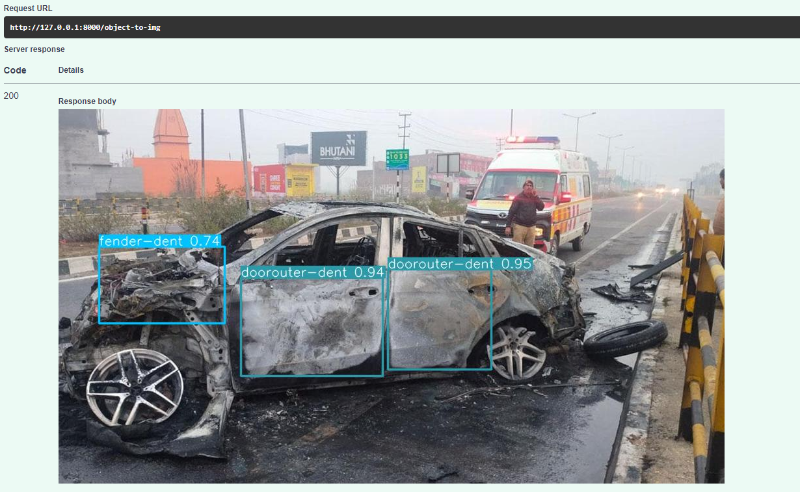

<p align="center"><br></p>
<p align="center"><h1>Car Dekhliya</h1></p>

An AI tool that streamlines your car insurance process by detecting damages with the most accuracy.

## Table of Contents
- [Background](#background)
- [Installation](#installation)
- [Usage](#usage)
- [API](#api)
- [TODO](#todo)
- [Contributing](#contributing)
- [License](#license)

<h2>Background</h2>
Car damages can be a major safety hazard if not detected and repaired in time. However, detecting damages in cars can be a tedious and time-consuming task for humans. This is where machine learning can be of great help. By training a machine learning model on a dataset of car images with damages, we can develop an automated system for detecting damages in cars.

<h2>Installation</h2>
To install the necessary dependencies for this project, run the following command:

```python
pip install -r requirements.txt
```

<h2>Usage</h2>
To use the car damage detection model, follow these steps:

- Clone this repository
- Install the necessary dependencies
- Run the prediction_engine.py script
- Provide the path to the image you want to test
- The script will output whether the car has damages or not

```python
from prediction_engine import get_yolov5
model = get_yolov5(input_image)
print(model)
```
<h2>API</h2>
The POST methods in the `app.py` file:

```python
"/obj-to-json"
```
This will return the predictions in a JSON format in the response body

```json
{
  "result": [
    {
      "xmin": 330.4482116699,
      "ymin": 80.6117782593,
      "xmax": 649.321105957,
      "ymax": 470.5021972656,
      "confidence": 0.9025965333,
      "class": 15,
      "name": "rear-bumper-dent"
    }
  ]
}
```

```python
"/obj-to-img"
```
This route will return the resulting image with bounding box around the detected damage area.
<p align="left"><br></p>

and finally,
```python
"/severity"
```
This route returns the severity of the damage into 3 classes, `minor`, `moderate`, `severe`.
```json
{
  "result": {
    "severity": "minor"
  }
}
```

<h2>TODO</h2>

- [x] Percentage value of damage on a vechicle
- [ ] Generalize the model for any damaged object
- [ ] Add a ChatGPT powered chatbot that assists the customer throughout the process

<h2>Contributing</h2>
We welcome contributions to this project. To contribute, please fork this repository, make your changes, and submit a pull request.

<h2>License</h2>
This project is licensed under the MIT License. See the LICENSE file for details.
